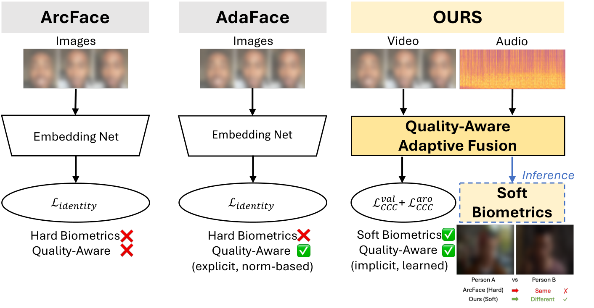
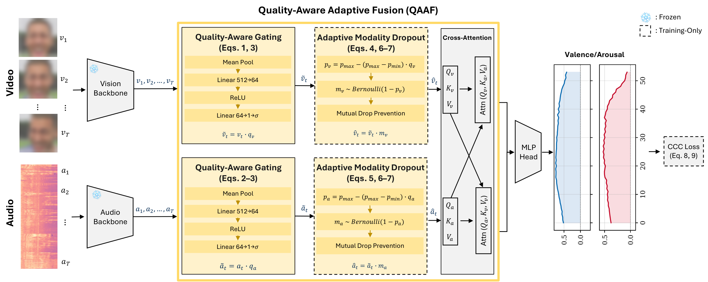

# QAAF: Quality-Aware Adaptive Fusion

Code for **"Quality-Aware Multimodal Fusion Reveals Implicit Identity in
Valence-Arousal Features"**, accepted at IJCB 2026.
Paper: [arXiv:2607.21347](https://arxiv.org/abs/2607.21347).

<p align="center">
  
</p>

Multimodal valence-arousal (VA) estimation is used here as a pretext task.
QAAF estimates per-sample, per-modality reliability and adapts each modality's
contribution through two label-free components:

- **QAG**, quality-aware gating: a small network scores each modality per sample
  and scales its contribution. Active at training and at inference.
- **AMD**, adaptive modality dropout: a quality-dependent dropout rate, so
  unreliable modalities are dropped more often. Training only.

<p align="center">
  
</p>

The paper then probes what those VA-trained representations encode, and finds
identity-discriminative structure that no identity supervision put there.

The figures are from the paper. Faces in the dataset examples are blurred here.

## What this repository contains

Fusion training and every evaluation in the paper: the valence-arousal results
and the verification experiments on AFEW-VA and YTF.

It starts from cached backbone features. Fine-tuning the backbones on Aff-wild2
and running them over the corpus to produce those features is not included; the
settings for that stage are recorded in `configs/main_table.yaml`, and
[docs/REPRODUCING.md](docs/REPRODUCING.md) says exactly what is and is not here.

```
paths.py                   every dataset / output location, read from the environment
configs/main_table.yaml    the training configuration behind the reported results
scripts/                   runnable pipeline, stage by stage
models/  losses/           the fusion wrapper; QAG, AMD and the other gating modules
datasets/                  the cached-feature dataset
docs/DATA.md               how to obtain the datasets and lay them out
docs/REPRODUCING.md        what this repository covers, and which script makes which table
assets/                    the two README figures
```

The gating and dropout modules are in `losses/da_losses.py`
(`QualityAwareGating`, `AdaptiveModalityDropout`, and the `QMFGating` and
`FixedGating` controls). The fusion wrapper that composes them is
`models/two_transformers_da.py`.

## Install

```bash
conda env create -f environment.yml
conda activate qaaf
```

or, into an existing Python 3.11 environment:

```bash
pip install -r requirements.txt
pip install -r requirements-baselines.txt   # only for the comparison baselines
```

One file pair is not bundled: the multimodal fusion transformer that QAG and AMD
wrap. Take `mm_transformers.py` and `mm_multi_transformers.py` from the Joint
Multimodal Transformer implementation cited in the paper and put them in
`models/`. Without them the code raises an error saying exactly this.

Those files may carry a top-level `from comet_ml import Experiment`. It is
unused; delete that line rather than installing comet_ml.

## Run

Datasets are not redistributed here. Get them from their providers, then:

```bash
export QAAF_DATA_ROOT=/path/to/datasets
export QAAF_WORK_ROOT=/path/to/outputs

scripts/train_main_table.sh 0          # train the fusion module, seed 0
scripts/extract_eval_features.sh       # cache features for the verification tables
scripts/eval_biometric.sh              # the verification experiments
```

`scripts/train_main_table.sh` with no arguments runs the full 6 methods x
3 backbones x 10 seeds grid behind the main table. Fusion training runs on
cached features, so a single run is cheap; the cost is in the count.

Every path is an environment variable with a repository-relative default. See
the top of `paths.py` for the full list.

## Datasets

| Dataset | Role |
|---|---|
| Aff-wild2 | valence-arousal training and validation |
| AFEW-VA | verification benchmark, 67 actors |
| YTF | verification benchmark, 1,595 subjects, 5,000-pair protocol |

Access procedures and the expected directory layout are in
[docs/DATA.md](docs/DATA.md). The AFEW-VA verification split is not shipped
because it is keyed by actor identity; the recipe that reproduces it exactly is
documented there.

## Intended use

This code studies whether representations trained for affect leak identity. It
is released so that finding can be checked and built on, including by work that
aims to prevent the leakage. It is not a face recognition system and should not
be deployed as one: the verification benchmarks here are small, they pair clips
within their own split, and nothing in this repository has been evaluated for
fairness across demographic groups.

## Citing

Jisu Kim and Benjamin S. Riggan, University of Tennessee, Knoxville. Machine
readable metadata is in [CITATION.cff](CITATION.cff).

```bibtex
@inproceedings{qaaf2026,
  author    = {Kim, Jisu and Riggan, Benjamin S.},
  title     = {Quality-Aware Multimodal Fusion Reveals Implicit Identity in
               Valence-Arousal Features},
  booktitle = {IEEE International Joint Conference on Biometrics (IJCB)},
  year      = {2026},
  eprint    = {2607.21347},
  archivePrefix = {arXiv},
  primaryClass  = {cs.CV},
  note      = {To appear}
}
```

Once the proceedings are published, add `pages` and `doi` to that entry and drop
the `note`. Keep the `eprint` fields: a preprint identifier stays useful after
publication, and it is what makes the paper reachable for anyone without IEEE
access.

## Licence

MIT. See [LICENSE](LICENSE).

The fusion transformer that QAG and AMD wrap is not part of this repository; see
"Install". Everything here is original to this work.
